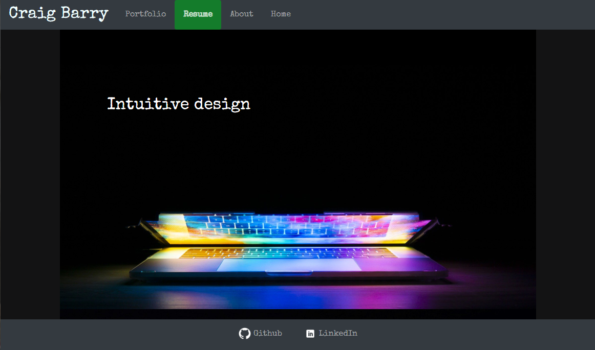
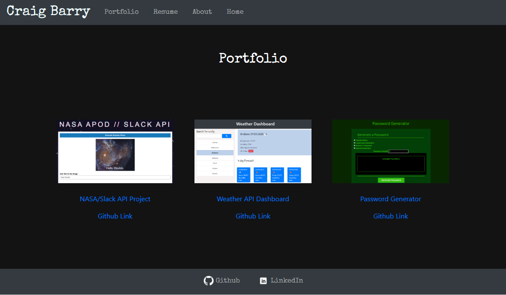

# portfolio site

This is a portfolio page for some of the sites I have built at Adelaide University Bootcamp.
The site utilizes Bootstrap and jquery to dynamically add content and provide a mobile-first user friendly design. I have added the URLs for my LinkedIn and Github pages and attached a copy of my resume to the website.

# Deployed URL
https://craigfbarry.github.io/portfolio/

# Github URL
https://github.com/craigfbarry/portfolio

# Attributions

https://pixabay.com/users/joshuaworoniecki-12734309/

https://unsplash.com/@mnm_all?utm_source=unsplash&utm_medium=referral&utm_content=creditCopyText

https://www.pexels.com/@danny-meneses-340146

# Author Craig Barry

https://github.com/craigfbarry
